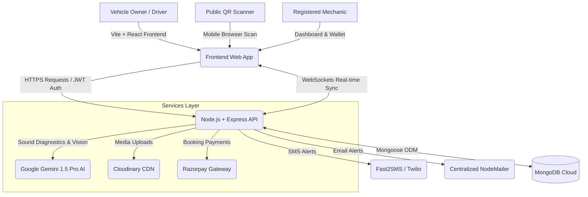

# Project Synopsis: Parxéé City
**A Smart City Vehicle Protection, Emergency Roadside Services, and EV Infrastructure Platform**

---

## 1. Project Title & Overview
**Project Title**: Parxéé City (also known as Parka City)  
**Domain**: Smart City Infrastructure, Automotive Technology, IoT Integration, & Emergency Services  
**Deployment Status**:
* **Frontend Portal**: [https://parka-frontend.vercel.app/](https://parka-frontend.vercel.app/)
* **Backend API**: [https://parka-backend.vercel.app/](https://parka-backend.vercel.app/)

Parxéé City is an all-in-one web platform engineered to modernize vehicle safety, roadside emergency dispatching, EV charging access, and urban parking utilization. The core innovation centers around **Smart QR-based Emergency Stickers** that allow secure, privacy-preserving driver communication, integrated with a **live bidding-based mechanic rescue system**, a **peer-to-peer parking and EV charging sharing hub**, and an **AI-powered Engine Sound Doctor & Sentinel dashcam system**.

---

## 2. Problem Statement
Urban vehicular ecosystems face several unaddressed friction points:
1. **Privacy Risk in Vehicle Alerts**: When a vehicle blocks a driveway, is double-parked, or has an emergency (e.g., window open, alarm ringing), citizens often have to scratch the car, break wipers, or search for the owner. Leaving a phone number on the dashboard exposes owners (especially women) to spam, stalking, and security risks.
2. **Delayed Emergency Assistance**: Conventional roadside assistance is slow, expensive, and non-transparent. Stranded drivers have no way to request immediate help with real-time bidding and tracking.
3. **Underutilized Charging & Parking Infrastructure**: Private parking spots and home EV chargers remain vacant for hours, while EV owners face charging anxiety and parking shortages.
4. **Lack of Automated Accident Recording**: Most budget vehicles do not have built-in dashcams or automated impact/SOS notification systems.

---

## 3. Proposed Solution
Parxéé City provides a secure, decentralized web ecosystem resolving these challenges through four primary pillars:
* **Smart QR Stickers**: Scannable window tags that link to a secure communication gateway. Scanners can contact owners via anonymous phone masking or preset SMS/Email alerts without revealing numbers.
* **On-Demand SOS & Mechanic Auction System**: Stranded drivers can trigger a localized SOS request (general mechanical or EV rescue) which mechanics bid on in real-time. Includes real-time tracking, chat, and wallet fee deduction.
* **EV Charging & Parking Sharing Hub**: Homeowners can list their vacant parking spaces and EV chargers, allowing other drivers to locate, book slots, and pay via Razorpay.
* **AI Diagnostics & Sentinel Mode**: A smartphone-based virtual dashcam (Sentinel) that uses the accelerometer to detect impacts, record video evidence, and auto-dispatch an SOS. Coupled with an AI Engine Sound Doctor that parses engine audio (FFT frequency peaks) to diagnose faults using Gemini AI.

---

## 4. System Architecture
The application is built on the **MERN (MongoDB, Express, React, Node.js) Stack** with real-time bidirectional communication via **Socket.io**.

---

## 5. Technology Stack
* **Frontend**: React.js (v19), Vite, React Router, Tailwind/CSS custom layouts, Leaflet Maps (Map tracking).
* **Backend**: Node.js, Express.js (v5), Socket.io (real-time communication), Webpush (push notifications), Multer.
* **Database**: MongoDB (Atlas Cloud) with Mongoose ODM.
* **Cloud Services & External Integrations**:
  * **Google Generative AI**: Gemini 1.5 Pro for audio diagnostics & image inspection.
  * **Cloudinary**: Cloud media storage for Sentinel dashcam videos & vehicle proof photos.
  * **Razorpay API**: payment processing for EV Charger bookings & space rentals.
  * **Nodemailer / Fast2SMS**: Multi-channel email and SMS gateway.

---

## 6. Key Modules & Features

### 1. Smart QR Tag Activation & Driver Alerting Gateway
* **Pre-printed QR Tags**: Each vehicle gets a unique `stickerId`. 
* **Activation Flow**: Secured via a 2-factor OTP (SMS/Email) generating a temporary JWT session. The user registers vehicle details (Make, Model, Color, Plate Number) and emergency contacts.
* **Anonymous Contact Portal**: Scanners scan the QR to view basic vehicle metadata. They can send pre-configured alerts ("Blocking Way", "Towing Alert", "Window Open") which triggers background SMS & Email dispatches.
* **Secure Calling**: Provides a captcha-secured calling feature with rate limits to prevent spam.

### 2. Roadside SOS Bidding & Live Dispatch System
* **Emergency Broadcast**: Stranded users request a "General Rescue" or "EV Rescue" with their live GPS coordinates.
* **Live Auction / Bidding**: Nearby mechanics receive push alerts and bid (price, ETA distance) for the request.
* **Confirmation & Tracking**: User selects a bid. The portal locks the contract, deducts a platform success fee (₹89) from the mechanic's digital wallet, initiates a private chat session, and tracks the mechanic’s movement dynamically on Leaflet maps.

### 3. EV Hub & Peer-to-Peer Parking Hosting
* **Host Station**: Spot owners list vacant driveways, garages, or open plots, configuring price per hour, plug types (16A, CCS2, Type 2), charger speed (kW), and timing availabilities.
* **Booking & Unlock**: Drivers filter stations by coordinates, reserve time slots, and pay via Razorpay. Upon successful verification, the charger booking status unlocks.

### 4. AI Engine Sound Doctor (Multimodal Diagnostics)
* **FFT Acoustic Diagnostics**: Users record their engine noise. The Web Audio API performs a Fast Fourier Transform, identifying frequency peaks. 
* **Multimodal Inspection**: Users can upload engine compartment photographs.
* **Generative Diagnostics**: The backend forwards the text descriptions, peaks, and base64 images to Google's Gemini 1.5 Pro model. It returns a WhatsApp-style Hinglish analysis detailing the issue, danger severity, repair estimates, and mechanic categories.
* **Offline Hybrid Fallback**: If the Gemini API key is absent, a custom keyword matcher analyzes inputs against a comprehensive local automotive fault database.

### 5. Sentinel Mode (Virtual Dashcam & Impact Notification)
* **Dual-Screen Roles**: Allows one device (phone mounted on windshield) to act as the "Front Dashcam" and another (tablet/car screen) to act as the "Rear Interface" synced over WebSockets.
* **Impact Sensing**: Leverages the device's accelerometer to monitor G-force. Exceeding thresholds triggers a 10-second countdown.
* **Emergency Dispatch**: If not cancelled, it auto-broadcasts an SOS request, records video proof, and uploads it to Cloudinary as evidence of the crash.

---

## 7. Database Model Schema (MongoDB Entities)

| Model Name | Primary Attributes | Purpose |
|---|---|---|
| **User** | Name, Phone, Email, PlateNumber, VehicleDetails, SubscriptionTier, SmartTagId | Stores profiles of drivers and vehicle owners |
| **Sticker** | StickerId, Status (Active/Inactive), UserId, Phone, VehicleNumber, ActivationDate | Tracks pre-printed QR stickers and active links to owners |
| **Mechanic** | Name, Phone, Email, WalletBalance, Specialization, Location, Rating | Profiles of rescue mechanics with credit balance |
| **SOSRequest** | UserId, Location, Type (General/EV), Status, Bids, AssignedBid, ChatMessages, EvidenceUrl | Manages active road emergencies and live bids |
| **EVCharger** | HostId, HostName, Address, PlugType, Price, Speed, Timings, Location, Security | Stores peer-to-peer EV charging station info |
| **EVBooking** | ChargerId, UserId, Hours, Price, PaymentOrderId, Status | Tracks Razorpay orders and charger slot reservations |
| **Space** | HostId, Address, PricePerHour, SpotType, Amenities, Location, Availability | Holds driveway/garage listings for parking rentals |
| **ScanHistory** | StickerId, IP Address, UserAgent, Location (Lat/Lng), Timestamp | Logs analytics whenever a QR sticker is scanned |

---

## 8. Future Scope & Enhancements
1. **IoT OBD-II Smart Integration**: Connect the app to Bluetooth OBD-II scanners inside the car to pull real-time engine diagnostics codes (DTCs) directly into the AI Engine Sound Doctor.
2. **Mobile Apps with Native Push & WebRTC Video**: Wrap the portals using React Native to support system-level hardware background listening and direct peer-to-peer WebRTC video calling between scanner and driver.
3. **Automated Parking Sensors**: Integrate ultrasonic IoT sensors with hosted parking spaces to display real-time vacant/occupied slot statuses on the maps without human intervention.
4. **Geofenced Emergency Auto-Routing**: Dynamically suggest traffic detours or immediate safety spots to drivers whose Sentinel mode detects abnormal engine temperatures or minor collisions.

---
*Built for Smarter, Safer, and Connected Urban Communities.*
